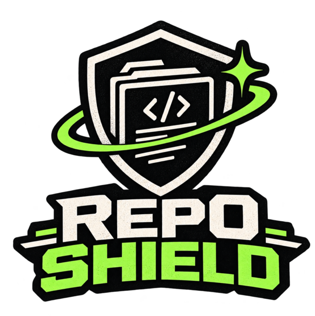

<p align="center">
  
</p>

# Repo Shield

**Claim your code. Stop AI pipelines from silently training on it.**

Your public repos get bulk-ingested into AI training corpora every day — no
consent, no credit, often no trace. Repo Shield gives you a simple, honest,
enforceable position: a signed `LICENSE`, an explicit AI-training `NOTICE`, a
machine-readable policy, and a weekly watch that keeps them from fading.

Free, open source, and only as complicated as you want it to be.

> **Honest caveat:** this is deterrence, not enforcement. Generated files stake
> your position and make accidental ingestion visible. Nobody can "block" AI
> scrapers, and anyone who promises that is selling a lie.

## Get started

One terminal, three commands, zero servers:

```bash
npm i -g @reposell/repo-shield   # installs `rs`
rs login                    # sign in with GitHub (device flow, no password)
rs protect --all            # open a protection PR on every installed repo
```

Or protect a single repo: `rs protect owner/repo`.

Before `rs protect` can write, install the **reposell** app on the repos you
want to protect: [`https://github.com/apps/reposell/installations/new`](https://github.com/apps/reposell/installations/new)

What happens next: Repo Shield writes the pack as one commit on a
`repo-shield/protect` branch and opens **one pull request per repo**. Nothing on
your default branch changes until you review and merge. Re-running on the same
repo just reuses the open PR.

## What's in the pack

| File | Purpose |
|------|---------|
| `LICENSE` | Your chosen license, with an SPDX identifier |
| `NOTICE` | Copyright + explicit AI-training consent clause |
| `AI_TRAINING_POLICY.md` | Machine-readable consent key |

Plus two kept-in-sync extras for public repos:

| File | Purpose |
|------|---------|
| `REPO_SHIELD.txt` | Signature marker that flags copies in scrape scans |
| `.github/workflows/repo-shield.yml` | Weekly monitor (runs in your repo, not ours) |
| `scripts/shield-check.mjs` | The check itself — verifies files, license, markers |

The monitor runs weekly on GitHub Actions with your repo's existing
`GITHUB_TOKEN`. Repo Shield never sees your code.

## Pick a license

The defaults are the safest, most common choices for public code:

| License | When to use it |
|---------|----------------|
| **MIT** | The default. Permissive, tiny, understood everywhere. |
| **ISC** | Minimal permissive — the whole grant fits in a paragraph. |
| **Apache-2.0** | Permissive plus an explicit patent grant, for big projects. |
| **GPL-3.0** | Copyleft: derivatives must stay free. File as `GPL-3.0-only`. |
| **Unlicense** | Your code, public domain. |

Every license is written into your repo as the complete canonical text from the
official [SPDX](https://spdx.org/licenses/) registry — including Apache-2.0 and
GPL-3.0, no paste step needed. MIT and ISC get your holder and year filled in.
An approximate license is worse than none.

Every generated `LICENSE` carries an `SPDX-License-Identifier` header, and the
monitor verifies the identifier is from the known set and matches the `NOTICE`.
No AI-training clause, or a wrong license id, fails the weekly check and opens
an issue telling you exactly which file to fix.

## No GitHub account?

Build the pack straight from the manual mode on the site
([`#/generate`](https://enzovezzaro.github.io/repo-shield/#/generate)) — pick
the files you want and download them, or use `apply-all.sh` offline.

## For agents

The same flow is packaged as an Agent Skill for coding agents
(`skills/repo-shield/SKILL.md`) — an agent can sign in once, protect a repo or
an organisation, and report the PR numbers back. Same CLI, same pull requests,
same review step before anything merges.

## Open source

Repo Shield is free and open source, with the condition that it stays *yours*:
the **Repo Shield Source License (No AI Training)** lets anyone use, read, and
improve this code, and explicitly forbids using the software itself to train a
machine-learning model. Full terms in [`LICENSE`](./LICENSE).

If the tool saves your repos from a scrape, a small donation covers hosting and
maintenance:

- **[Donate](https://enzovezzaro.github.io/repo-shield/#/support)**
- **[Star on GitHub](https://github.com/EnzoVezzaro/repo-shield)**
- **[Read the design system](DESIGN.md)**

## Development

```bash
npm install
npm run dev        # local dev server
npm run build      # production build
npm run typecheck
npm test           # pack + license + CLI protect-flow unit tests
```

Static Vite + TypeScript app, deployed to GitHub Pages. No server components.
Requires Node 22.6+ to run the CLI directly.